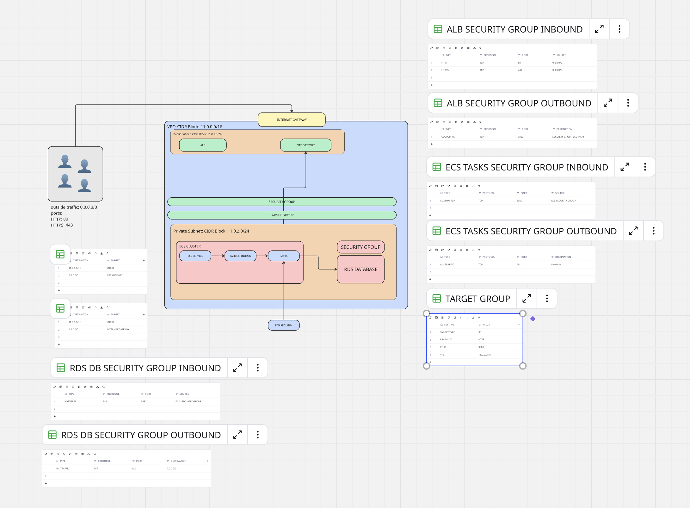

# Project 1 Documentation: ECS + RDS + ROUTE 53

This is my Internship project, which I have deployed via AWS Elastic Container Service (ECS).

## 📖 Project Overview

This project is a containerized Next.js web application deployed on AWS using a serverless architecture. The application is served on my custom domain, `omershahzad.me`, with DNS fully managed by Amazon Route 53. When a user visits the website, their request first hits the Application Load Balancer (ALB) over a secure HTTPS connection, protected by a free SSL/TLS certificate from AWS Certificate Manager (ACM). The ALB then forwards this traffic to my Next.js Docker container, which is running on port 3000 and managed by AWS ECS Fargate. Fargate automatically handles the underlying servers and scales these containers based on traffic, pulling the latest Docker image directly from my Amazon ECR repository. For data storage, the containers securely connect to an Amazon RDS PostgreSQL database. Everything is locked down using strict security groups, ensuring that the outside world can only communicate with the load balancer, while the internal containers remain securely isolated.

### 🗺️ Architecture Diagram


*(You can also view the interactive diagram on [Miro](https://miro.com/app/board/uXjVHEwy-r0=/?share_link_id=251488959992))*

---

## 🏗️ Technical Architecture & Infrastructure Details

The project is a containerized Next.js application that integrates with various AWS services. Below is a breakdown of how the application is connected and works with ECS, ECR, RDS, and other networking components.

### 🐳 Container & Amazon ECR (Elastic Container Registry)
- The application is containerized using Docker. 
- The Docker image is pushed to and hosted in an **Amazon ECR repository** (`395063533284.dkr.ecr.us-east-2.amazonaws.com/omer/loop`).
- ECS fetches the `latest` tagged image from this repository to run the containerized application.

### ⚙️ Amazon ECS (Elastic Container Service)
- **Cluster & Service**: The application runs inside an ECS cluster (`loop`) using the `awsvpc` network mode. The `omer-internship-project-service` continuously monitors and ensures the desired number of tasks are always running.
- **Task Definition**: The ECS task (`omer-internship-project`) is configured with 1024 CPU units and 2048 MB memory. It runs the container and securely injects all necessary environment variables, including the RDS database credentials.
- **Compute (Fargate)**: The service uses **AWS Fargate** (serverless compute for containers), specifically utilizing `FARGATE` and `FARGATE_SPOT` capacity providers. This means there are no underlying EC2 instances to manage, and resources scale seamlessly based on demand.

### 🗄️ Database (Amazon RDS)
- The application connects to an **Amazon RDS PostgreSQL instance** (`loop-db` running engine version `18.3` on a `db.t4g.micro` instance).
- **Endpoint**: `loop-db.c5m0c60ykcap.us-east-2.rds.amazonaws.com` on port `5432`.
- **Deployment Details**: The database is provisioned with 20GB of `gp2` encrypted storage and has Performance Insights enabled for monitoring.
- **RDS Security Group**: The database is attached to the security group `sg-07b33f464d0989c25` (`loop-db-security-group`), which resides in the default VPC (`vpc-022f2c6a2433e6676`).
  - **Inbound**: Allows TCP traffic on port `5432` from anywhere (`0.0.0.0/0`).
  - **Accessibility**: The RDS instance is configured as `PubliclyAccessible: true`, allowing the ECS Fargate tasks (which run in the separate `loop-vpc`) to connect to it over the internet using a secure connection string.

### 🌍 Domain, DNS (Route 53) & SSL/TLS
- **Custom Domain**: The application is securely served on my custom domain, `omershahzad.me`, which was originally purchased through Namecheap.
- **DNS Management**: I updated the domain's nameservers at Namecheap to point to **Amazon Route 53**. Route 53 now fully manages all DNS records and efficiently routes internet traffic directly to the AWS Application Load Balancer.
- **SSL Certification**: To ensure secure, encrypted connections, I generated a free, auto-renewing SSL/TLS certificate through **AWS Certificate Manager (ACM)**. This certificate is securely attached to the Application Load Balancer.

### ⚖️ Load Balancing & Target Groups
- **Application Load Balancer (ALB)**: The internet-facing ALB (`loop-load-balancer`) serves as the entry point for all incoming traffic.
  - **Listeners**: It is configured with listeners for **HTTPS (443)** using an SSL/TLS certificate for `omershahzad.me`, and **HTTP (80)**. Both listeners forward incoming requests directly to the target group.
  - **DNS**: Available publicly via `loop-load-balancer-165822915.us-east-2.elb.amazonaws.com`.
- **Target Groups**: The ALB routes traffic to a specific **Target Group** (`loop-target-group`) configured with:
  - **ARN**: `arn:aws:elasticloadbalancing:us-east-2:395063533284:targetgroup/loop-target-group/a9eba82b8d9d6bfd`
  - **Target Type**: `IP` (for ECS `awsvpc` networking)
  - **Protocol/Port**: `HTTP` (HTTP1) on port `3000`
  - **VPC**: `vpc-008d9c20fbf8fe036` (`11.0.0.0/16`)
  
  Currently, the target group manages **2 healthy registered targets** (IPs `11.0.2.196` and `11.0.2.97` running in the `us-east-2a` availability zone). It continually performs health checks (checking path `/` with 200 OK) to ensure traffic is only routed to healthy Next.js containers.

### 🌐 Virtual Private Cloud (VPC) & Networking
The application infrastructure is deployed in a custom AWS Virtual Private Cloud to ensure network isolation and security:
- **VPC Details**: Deployed in a custom VPC named `loop-vpc` (`vpc-008d9c20fbf8fe036`) with a CIDR block of `11.0.0.0/16` in the `us-east-2` region.
- **Subnets**: The architecture spans multiple Availability Zones (`us-east-2a` and `us-east-2b`) for high availability, utilizing a mix of public subnets (`loop-public-subnet`, `loop-public-subnet-2`) and a private subnet (`loop-private-subnet`).
- **Gateways**: Internet access and routing are managed via an Internet Gateway (`loop-internet-gateway`) for public resources. For the private subnets, a NAT Gateway (`loop-nat-gateway`, ID: `nat-11fa2bf1f4fa4f6f5`) is used to provide secure outbound internet connectivity, utilizing the static public Elastic IP `18.188.22.70`.

### 🔒 Security Groups
Network traffic is strictly controlled using a least-privilege approach with explicit inbound and outbound rules:

**1. ALB Security Group**
- **Inbound**: Allows HTTP (port 80) and HTTPS (port 443) traffic from anywhere (`0.0.0.0/0`).
- **Outbound**: Custom TCP traffic is allowed on port `3000` destined **only** for the `ECS TASKS SECURITY GROUP`.

**2. ECS Tasks Security Group** (`sg-0ebdced1a0d17b2d3`)
- **Inbound**: Only allows Custom TCP traffic on port `3000` originating **specifically from the ALB Security Group**. This ensures the containers cannot be accessed directly from the internet.
- **Outbound**: Allows ALL traffic (`0.0.0.0/0`) out to the internet (routed through the NAT Gateway for tasks in private subnets).

---

*Original Next.js project details:*

This is a [Next.js](https://nextjs.org) project bootstrapped with [`create-next-app`](https://nextjs.org/docs/app/api-reference/cli/create-next-app).

## Getting Started

First, run the development server:

```bash
npm run dev
# or
yarn dev
# or
pnpm dev
# or
bun dev
```

Open [http://localhost:3000](http://localhost:3000) with your browser to see the result.

You can start editing the page by modifying `app/page.tsx`. The page auto-updates as you edit the file.

This project uses [`next/font`](https://nextjs.org/docs/app/building-your-application/optimizing/fonts) to automatically optimize and load [Geist](https://vercel.com/font), a new font family for Vercel.

## Learn More

To learn more about Next.js, take a look at the following resources:

- [Next.js Documentation](https://nextjs.org/docs) - learn about Next.js features and API.
- [Learn Next.js](https://nextjs.org/learn) - an interactive Next.js tutorial.

You can check out [the Next.js GitHub repository](https://github.com/vercel/next.js) - your feedback and contributions are welcome!

## Deploy on Vercel

The easiest way to deploy your Next.js app is to use the [Vercel Platform](https://vercel.com/new?utm_medium=default-template&filter=next.js&utm_source=create-next-app&utm_campaign=create-next-app-readme) from the creators of Next.js.

Check out our [Next.js deployment documentation](https://nextjs.org/docs/app/building-your-application/deploying) for more details.

